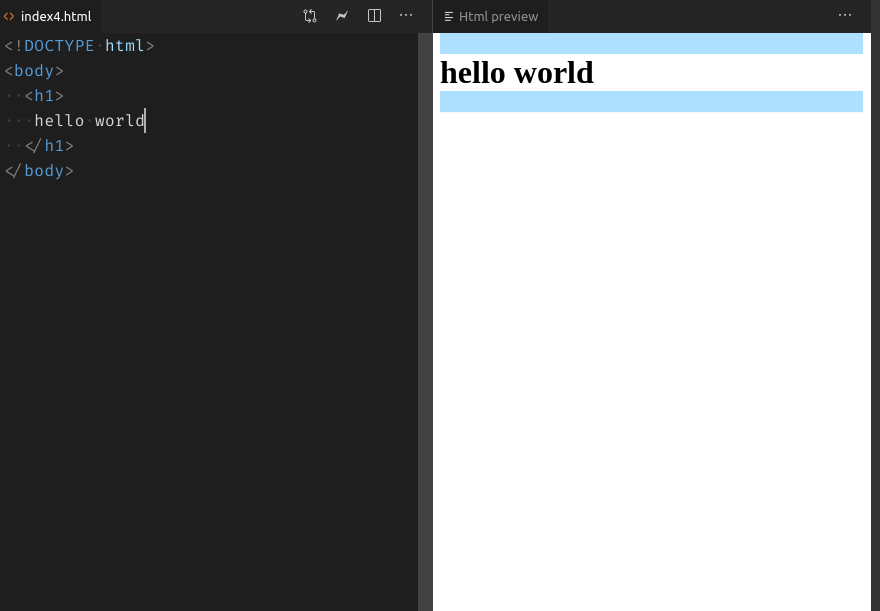

  

# Html Preview for VSCode

**New:** Web version available &rightarrow; [Demo](https://wizardly-ride-0e91ad.netlify.com/samples/code-mirror-sample)

<!-- TODO demo gif -->

## Features

- Live editing of HTML and CSS
- Highlighting of html elements inside the browser

<!-- ## TODO

- reload page when external resources (e.g. images, javascript) change -->

## Commands

| Command                            | Keybinding   |
| ---------------------------------- | ------------ |
| Html Preview: Open                 | `ctrl+alt+p` |
| Html Preview: Close Preview Server | none         |

## Settings

| Property              | Description                                                         | Default     |
| --------------------- | ------------------------------------------------------------------- | ----------- |
| htmlPreview.openWith  | Opens the preview with the specified application.                   | `"browser"` |
| htmlPreview.highlight | Highlight elements in the browser when they are selected in VSCode. | `true`      |

<!-- TODO use child process for efficiency -->
<!-- TODO implicit head body tbody tags -->

<!-- autoreload extension: nodemon --watch **/dist/** --exec node scripts/update-extension.js -->

<!-- TODO support insertion of element via javascript, preview insertions can be done by referencing beforeid and afterid -->
<!-- TODO live js via chrome devtools api / firefox devtools api similar to lighttable/brackets with chrome -->

<!-- TODO http caching -->

<!-- TODO stop probably not necessary because we can just disconnect when there are no more open sockets (meaning the user has closed the browser and probably wants to close the preview anyway, also he can just reopen the preview) -->

<!-- TODO when opening preview, open new files to the left -->

<!-- TODO shtml -->
<!-- TODO htm -->
<!-- TODO proxy? -->
<!-- TODO cors -->
<!-- TODO element moves https://trello.com/c/yMmDFqdq/928-live-html-support-moves -->
<!-- TODO better highlight position matching -->
<!-- TODO create vscode.workspace.createfilesystemwatcher -->
<!-- TODO pretty urls when opening, e.g. localhost:3000 instead of localhost:3000/index.html -->
<!-- TODO figure out whats best when another application is blocking the port (killing it or using another port) -->
<!-- TODO dispose listeners in live preview -->
<!-- TODO test when index.html is created or deleted, same for related files -->
<!-- TODO maybe use webworker when there is actually a lot of processing on the client -->
<!-- TODO test when css is deleted/created -->
<!-- TODO multiple files at the same time, only reload index.html and not about.html when index.html is changed -->
<!-- TODO like brackets: when no html file is opened, find the closest html file and open it -->
<!-- TODO move extension tests to html-preview-service -->
<!-- TODO select text in editor when selected in browser -->
<!-- TODO fix bug <body>
  <ul>
    <li>live edit</li>
    <li>another one</li>
    <li></li>
    <li></li>
  </ul>
  

  TabNine::live TabNine::an

  <button>
  this is tab nice
  
  this
  is TabNine
  <ul>

  <li>another</li>
  <li></li>
  <li></li>
  <li></li>
  
  </button>
</body>
 cannot start with invalid html-->
<!-- TODO build badge should have same style as other badges -->

<!-- TODO bug
<h1>hello world</h1>

this is live edit

insert 

 around text
then replace the p with h2
not working
 -->

<!-- TODO bug insert ! press tab with emmet, shows $node is not defined -->
<!-- TODO reload plugin not working when opening preview inside vscode -->
<!-- TODO liveshare integration -->

<!-- TODO bug
<!DOCTYPE html>
<head>
  
</head>
<section>
  <h1>hello world 1</h1>
</section>

<button>
  this is a button
</button>

<input type="checkbox" name="" id="" />
<input type="checkbox" name="" id="" />
<input type="checkbox" name="" id="" />

hydration error
 -->
<!-- TODO live update settings -->
<!-- TODO styleguide: no function keyword, no this, no let, no classes, no export default, no more than 2 parameters -->
<!-- TODO enable every strict option in typescript (initialization, no implicit any etc) -->

<!-- TODO bug

/* button {
  --color: rgba(37, 23, 226, 0.808);
  border: 2px solid var(--color);
  border-radius: 10px;
  padding: 20px;
  background: transparent;
  box-sizing: border-box;
}
button:hover {
  background: var(--color);
  color: white;
  cursor: pointer;
} */

/* html,
body {
  height: 100%;
}
body {
  margin: 0;
  display: grid;
  place-items: center;
} */

button,
p {
  color: red;
  padding: 20px;
}

p {
  /* box-sizing: border-box; */
}

p{
  padding: 40px;
}

highlight in css not working with comment
 -->

<!-- TODO keep highlight of html element if css is edited (better: highlight from css inside html)-->

<!-- TODO fix highlight of borders -->
<!-- TODO lots of tests for highlight etc -->
<!-- TODO why is

<!DOCTYPE html>
<html lang="en">
<head>
  <meta charset="UTF-8">
  <meta name="viewport" content="width=device-width, initial-scale=1.0">
  <meta http-equiv="X-UA-Compatible" content="ie=edge">
  <title>Document</title>
</head>
<body>
  
0

</html>

invalid? -->

<!-- TODO dynamic html, e.g. http://bl.ocks.org/d3noob/8952219 -->

<!-- TODO bug  -->

## Credits

Much of this project is based on the Live Preview feature by [Brackets](https://github.com/adobe/brackets)
